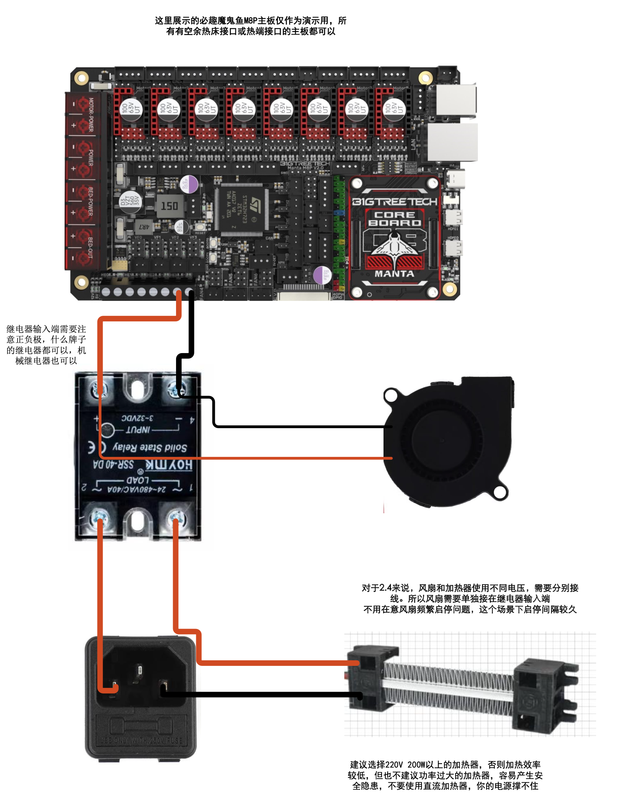
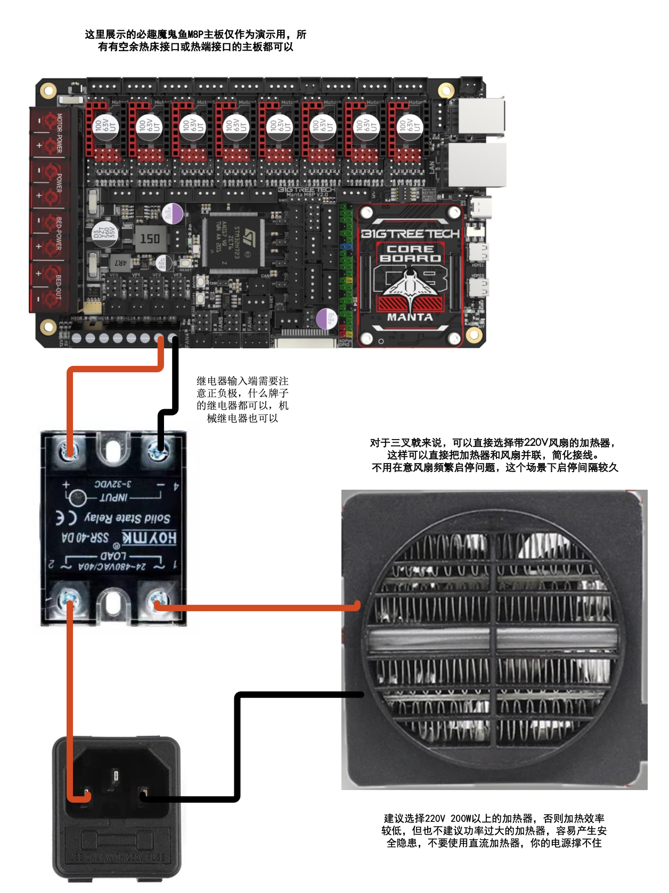

# DIY-3D-printer-heater
一个简单好用的3D打印机仓温加热模块

>### **视频来源**：[Bilibili@我是小一灰](https://www.bilibili.com/video/BV1Na4y1G7fo "我是小一灰")
>### QQ交流群：940677189、339148314（2群）
> ### **Gitee（国内）项目地址**：[3D打印机仓温加热模块]( "我是小一灰")
> ### **Github项目地址**：[3D打印机仓温加热模块]( "我是小一灰")

##### 配置文件、接线图等等都在项目里寻找就可以了
#### 配置文件修改教程：
```buildoutcfg
首先注释掉你原有的舱温传感器配置
#[temperature_sensor 仓温]
## sensor_type: NTC 100K MGB18-104F39050L32
#sensor_type: Generic 3950
#sensor_pin: PA2
#pullup_resistor:4700
如果你本来就没有舱温传感器，那就忽略，下方配置从舱温传感器中取的值，你自己找空余接口就行，分别是空闲的热敏接口、加热棒接口
接口的pin值需要你自己查阅你主板的pin图，如果你不知道什么是pin图，咨询你的主板卖家。但你不应该不知道！

[heater_generic hot]
#这一段完整的加到配置文件
heater_pin:PE1  # 修改为任意一个闲置加热棒端口（这里以M8P脚位为例）
max_power:1.0
sensor_type:NTC 100K MGB18-104F39050L32 # 修改为你舱温传感器型号
sensor_pin:PA2  # 修改为你舱温传感器sensor_pin的值
control = watermark
max_delta: 1.0
min_temp:-50
max_temp:70

[verify_heater hot] #舱温的名字不能随便改
#这一段完整的加到配置文件
max_error: 300
check_gain_time:480
hysteresis: 5
heating_gain: 1

[gcode_macro M141]
#这一段完整的加到配置文件
gcode:
      SET_HEATER_TEMPERATURE HEATER=hot TARGET={params.S}

   
[gcode_macro PRINT_END]
gcode:
    ...
    ...    
    #以上你的原有配置不要动
    M141 S0  # 就把这一行，加到你的[gcode_macro PRINT_END]配置项里，目的是在打印结束时，自动停止加热
    #以下你的原有配置不要用
    ...
    ...

[gcode_macro CANCEL_PRINT]
#如果你有取消打印宏，别忘了把M141 S0加到取消打印宏里

```
----
物料清单（Voron2.4）：

| 项目 | 数量 | 链接 | 备注 |
| ------- | ------- | ------- | ------- |
| 220V 200W 长条PTC加热器  | 1  | 暂无  | 视频中使用的尺寸是140×35×️26mm  |
| 5015风扇  | 1  | 暂无  |Voron SB头那种  |
| M3垫片  | 4  | 暂无  |  |
| M3*6杯头螺丝  | 6  | 暂无  |  |
| M3船形螺母  | 4  | 暂无  |型材用的船形螺母  |
| M3螺母  | 2  | 暂无  |6边形螺母  |
| 导线  | 若干  | 暂无  |注意功率  |
| 固态继电器  | 1  | 暂无  |问问卖家能不能带动你买的加热器功率  |
| NTC 100K热敏  | 1  | 暂无  |如果你没有仓温热敏，买这个  |


物料清单（Voron三叉戟）：

| 项目 | 数量 | 链接 | 备注 |
| ------- | ------- | ------- | ------- |
| 220V 200W 方形加热器  | 1  | 暂无  | 带220v风扇的  |
| M4*40杯头螺丝  | 2  | 暂无  |  |
| M3杯头螺丝  | 2  | 暂无  |  |
| M3船形螺母  | 2  | 暂无  |型材用的船形螺母  |
| 导线  | 若干  | 暂无  |注意功率  |
| 固态继电器  | 1  | 暂无  |问问卖家能不能带动你买的加热器功率  |
| NTC 100K热敏  | 1  | 暂无  |如果你没有仓温热敏，买这个  |

接线图在目录中找PDF文件
2.4接线图

三叉戟接线图

